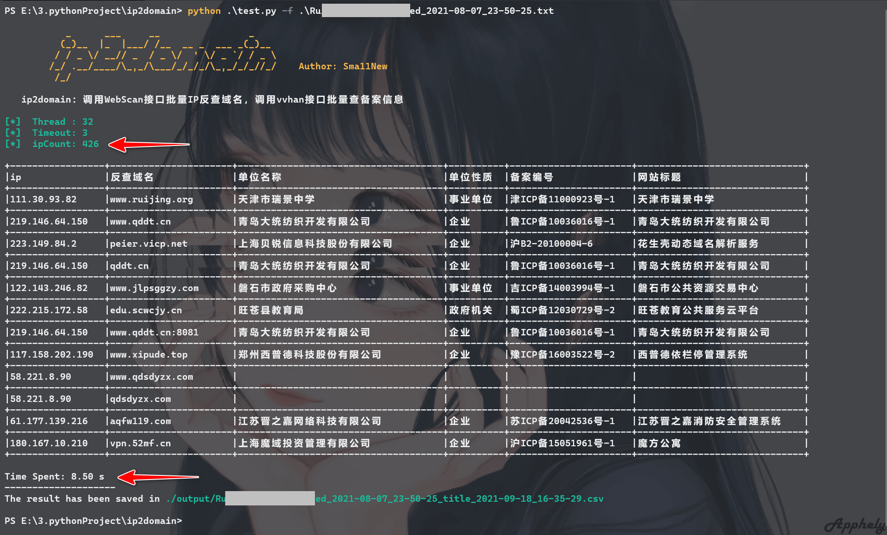
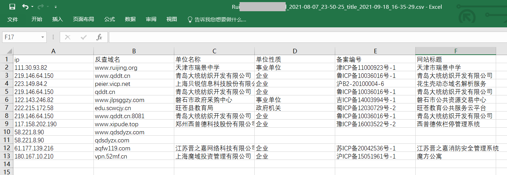

## 🎯ip2domain 批量查询ip对应域名及备案信息

在批量挖SRC时，通常会用较新的漏洞POC批量跑fofa或其他空间测绘的相关资产ip，该工具可用于对跑到的ip批量查询域名及备案信息，快速确定ip所属企业，方便提交漏洞。

### 📢说明

该工具是在之前的webEye上改进而来，由于webEye是检测IP端口站点存活后在页面匹配ICP号查询备案信息，准确率较低，因此改进为调用接口查询。

**功能特点如下：**

1.  快速批量查询备案信息；
2.  结果导出至Excel表格

代码中对域名做提取主域和已查询标记，同一域名仅查询并输出一次。

**注意：**

当**反查域名**列出现"-- Connect Failed --"时表示**反查域名**接口请求出错

当**单位名称**列出现"-- Connect Failed --"时表示**备案信息**接口请求出错

出现以上问题极有可能是请求频率过高，但由于是调用api而不是模拟浏览器请求，因此出现的概率极小。

### 🚩使用

安装依赖：

```
pip install -r requirements.txt
```

使用：

```
usage: ip2domain.py [-h] -f  [-t] [-T] [-o]

optional arguments:
  -h, --help      show this help message and exit
  -f, --file      Target IP file
  -t, --thread    Number of thread (default 32)
  -T, --Timeout   request timeout (default 3)
  -o, --output    output file (default ./output/{fileName}_title_{date}.csv)
```

将要查询的ip放在txt文件内一行一个，`python ip2domain.py -f [file]` 指定即可：



400多ip用时8秒，当前线程32，结果文件：



**欢迎使用，我愿称之为最强**