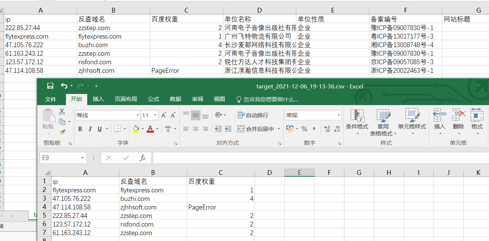

## 🕷ip2domain - 批量查询ip对应域名、备案信息、百度权重

在批量挖SRC时，通常会用较新的漏洞POC批量跑fofa或其他空间测绘的相关资产ip，该工具可用于对跑到的ip批量查询域名及百度权重、备案信息，快速确定ip所属企业，方便提交漏洞。


### 😏更新日志：

#### **2021-12-06 `(v0.2)`：**

-   加入百度权重查询（默认开启），-r可指定显示的权重阈值
-   优化ICP备案查询（默认关闭），--icp开启
-   鉴于接口限制问题，修改程序逻辑，改为单线程模式
-   修复部分问题

#### **2021-09-18 `(v0.1)`：**

-   初版落地，多线程批量快速反查域名、查询ICP备案信息

### 🤓参数说明

关键参数是-s、-r和--icp三个：

-   **-s 控制请求时延**，一般1稍快，但偶尔出现请求出错；**2速度适中**，基本不会出现问题；**3最为稳定**，程序挂在后台可稳定输出。
-   **-r 控制百度权重阈值**，0到10代表输出**大于等于**相应百度权重的结果，通常设定为1，可根据需求增减（-1会导致程序出现不可预料的错误）。
-   **--icp 控制是否查询ICP备案信息**，使用该参数即表示开启icp备案查询（默认关闭）。

所有参数：

```
usage: ip2domain.py [-h] -f  [-t] [-T] [-o]

usage: ip2domain.py [-h] [-t TARGET] [-f FILE] [-s DELAY] [-T TIMEOUT]
                    [-r RANK] [-o OUTPUT] [--icp]

optional arguments:
  -h, --help            show this help message and exit
  -t TARGET, --target TARGET 	Target ip/domain
  -f FILE, --file FILE  	Target ip/domain file
  -s DELAY, --delay DELAY 	Request delay (default 2s)
  -T TIMEOUT, --Timeout TIMEOUT 	Request timeout (default 3s)
  -r RANK, --rank RANK  	Show baiduRank size (default 0)
  -o OUTPUT, --output OUTPUT 	output file (default ./output/ip2domain_{fileName}_{date}.csv)
  --icp                 	With search icp (default false)
```

### 🚩使用示例

安装依赖：

```
pip install -r requirements.txt
```

将要查询的ip/domain放在txt文件内一行一个，`python ip2domain.py -f [file]` 指定，并加入其他参数即可。

**1、**百度权重阈值为1，请求时延为2，不开启ICP备案查询

```
python .\ip2domain.py -f E:\Desktop\target.txt -s 2 -r 1
```


出现了一次PageError，表示响应为200，但是页面未加载出来权重信息。

**2、**百度权重阈值为1，请求时延为2，开启ICP备案查询

```
python .\ip2domain.py -f E:\Desktop\target.txt -s 2 -r 1 --icp
```


结果保存在output目录下csv文件内



#### 接口问题，目前查询速度较慢。
